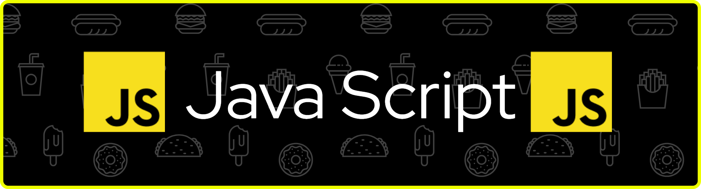

<header> 


<p align="center">

</p>


# Breve Resumo de Alguns Conceitos do Java Script 
<br>

| Tema | Descrição | Exemplos em JavaScript |
|:-----------:|:-----------:|:-----------:|
|[**Number**](1_number/number.js)|Tipo de dados para valores numéricos, tanto inteiros quanto de ponto flutuante.| `let idade = 25;`<br>`let preco = 19.99;`<br>`let temperatura = -5;`|
|[**Operações Aritméticas**](2_operacao_aritimetica\operacaoAritimetica.js)|Operações matemáticas básicas e avançadas com números.|`let soma = 10 + 5;`<br>`let subtracao = 10 - 5;`<br>`let multiplicacao = 10 * 5;`<br>`let divisao = 10 / 5;`<br>`let resto = 10 % 3;`|
|[**Números Especiais**](3_numeros_especiais\numerosEspeciais.js)|Valores numéricos especiais que representam conceitos matemáticos ou erros.|`let infinito = Infinity;`<br>`let naoNumero = NaN;`<br>`let infinitoNegativo = -Infinity;`|
|[**Strings**](4_string\string.js)|Sequência de caracteres usada para representar texto. Delimitadas por aspas simples, duplas ou crases.|`let nome = "João"; `<br>` let sobrenome = 'Silva';`<br>`let template = Olá, ${nome}!; `<br>` let frase = "Ele disse: 'Olá!'";`|
|[**Strings Avançados**](5_strings_avancados/stringsAvancados.js) | Manipulação avançada de texto. | `nome.length`<br>`nome.toUpperCase()` |
|[**Boolean**](6_boolean\boolean.js)|Tipo de dados que representa valores lógicos: verdadeiro ou falso.|`let ativo = true;`<br>`let desligado = false;`<br>`let maior = 10 > 5; // true`<br>`let igual = 10 === "10"; // false`|
|[**Comparações Booleanas**](7_comparacoes_booleanas\comparacoesBooleanas.js) | Comparações avançadas com booleanos. | `10 === "10"`<br>`10 == "10"` |
|[**Lógica Booleana**](8_logica_booleana\logicaBooleana.js) | AND, OR e NOT. | `true && false` `<br>` `true  false` `<br>` `!true` |
|[**Estruturas de Repetição**](8_estruturas_de_repetição\estruturasDeRepetição.js)|Controlam a execução repetida de blocos de código.|`for (let i = 0; i < 5; i++) { console.log(i); }`<br>`while (condicao) { /* código */ }`<br>`do { /* código */ } while (condicao);`<br>`for (let item of array) { /* código */ }`|
|[**Operador Ternário**](9_logica_booleana_ternario\logicaBooleanaTernario.js) | Ternário para condições rápidas. | `cond ? valor1 : valor2` |
|[**Valores Nulos**](10_valores_nulos\valoresNulos.js)|Representam a ausência intencional de valor ou referência vazia. | `let variavelNula = null;`<br>`let variavelIndefinida = undefined;`<br>`let x; // valor é undefined`|
|[**Conversão Automática**](11_conversão_automática\conversãoAutomática.js)| JavaScript converte automaticamente tipos em operações (coerção de tipos). | `"5" + 1 // "51"`<br>`"5" - 1 // 4`<br>`"5" * "2" // 10`<br>`true + 1 // 2`<br>`false + 1 // 1`<br>`null + 5 // 5`|                                                                                                        ||
<br>

# [**Estruturas de Programação**](12_EstruturasDeProgramação)  
# O que é um [**Programa**]() um [**Software**]() e um [**Hardware**]() ?
### Um programa ou software é um conjunto de instruções, dados e programas que dizem a um dispositivo digital o que fazer para realizar tarefas específicas. Diferente do hardware (a parte física), o software é a parte lógica e intangível, que inclui sistemas operacionais, aplicativos e ferramentas de um computador, celular ou outro dispositivo.
<br>

# Conceitos <br>
## Instruções: São a base do software. Uma sequência de instruções que diz ao computador como realizar uma tarefa é chamada de programa.
## Programa: é um conjunto organizado de instruções que dizem ao computador o que fazer, a fim de obter um resultado específico. Essas instruções são escritas em uma linguagem de programação e formam a base de todo o software que utilizamos.
## Software: refere-se à parte lógica do computador. É o conjunto de instruções, dados e programas que dizem ao hardware o que fazer. O software é intangível; você não pode tocá-lo fisicamente da mesma forma que toca um mouse.

## Hardware: é toda a parte física do computador ou sistema eletrônico. É tudo aquilo que você pode tocar e ver. 
<br>

# Exemplos de Programas <br>
## Sistemas Operacionais: Fazem o computador funcionar (ex: Windows, macOS).
## Aplicativos: Ferramentas que permitem que o usuário realize tarefas específicas, como:
## Processadores de texto (ex: Microsoft Word).
## Navegadores de internet (ex: Chrome, Firefox).
<br>

# Exemplos de Software:
## Sistemas Operacionais: Windows, macOS, Linux, Android (gerenciam os recursos do hardware).
## Aplicativos/Programas: Navegadores de internet (Chrome, Firefox), editores de texto (Word, Google Docs), jogos, softwares de edição de imagem.
## Firmware: Um tipo específico de software de baixo nível que controla dispositivos de hardware básicos (como a BIOS do computador)
<br>

# Exemplos de Hardware <br>
## Unidade Central de Processamento (CPU): O "cérebro" do computador.
## Memória RAM: O local de trabalho temporário do computador.
## Dispositivos de Armazenamento: Disco rígido (HD), SSD, pen drives.
## Periféricos de Entrada: Teclado, mouse, microfone, câmera.
## Periféricos de Saída: Monitor, impressora, alto-falantes. 
## Placa-mãe: O circuito principal que conecta todos os componentes.
<br>

# Jogos. <br>
## Softwares de edição de fotos e vídeos.
## Ferramentas de IA: Programas de inteligência artificial, como o ChatGPT. 
<br>

# Em resumo <br>
## Um programa é um conjunto individual de instruções para uma tarefa.
## Um software é uma coleção de programas e outros dados que trabalham juntos.
## Em termos práticos, "programa" e "software" são frequentemente usados de forma intercambiável para se referir a um aplicativo ou sistema que você usa em um dispositivo.  

<br>

# Principais Diferenças de Programa e Software

| Categoria de Análise| Hardware (Physical Layer)| Software (Computer Software)| Programa (Computer Program)|
|:---:|:---:|:---:|:---:|
| Definição Básica | Componentes físicos e eletrônicos do computador| Um termo guarda-chuva que inclui o programa principal, dados operacionais e documentação.| Componentes físicos e eletrônicos do computador.
| Natureza | Tangível (você pode tocar e sentir). | Tangível (você pode tocar e sentir).  | Foco na solução (produto lógico completo).|
| Foco | Fornecer a capacidade de processamento, armazenamento e interação física. |Solução completa, incluindo design, regras de negócio e usabilidade. | Gerenciar a interação entre o usuário e o hardware de forma útil.|
| Componentes | Partes físicas do computador, placa-mãe,processador (CPU),memória RAM, dispositivos de armazenamento (HD ou SSD), placa de vídeo (GPU), periféricos de entrada e saída como teclado, mouse, monitor e impressora |Código, scripts, bibliotecas, manuais e outros artefatos de suporte. | Principalmente o código-fonte/executável.|
| Uso comum | fornecer a base física e tangível que permite o funcionamento de qualquer dispositivo eletrônico, desde um smartphone até um supercomputador. |Termo técnico e jurídico mais formal para se referir ao produto completo. | Muitas vezes usado como sinônimo de software no dia a dia, mas tecnicamente mais específico. |
| Escopo | Definição do trabalho necessário para entregar um projeto de hardware, incluindo suas metas, resultados, requisitos, limites e restrições |Abrange todos os componentes lógicos necessários para uma solução completa (programas, dados, documentação, etc.). | Restrito ao conjunto de instruções executáveis para uma tarefa. |
| Componentes Chave | Arquivos executáveis como `.exe` , `.bin`, e scripts interpretáveis.| Executáveis, bibliotecas (DLLs), arquivos de configuração, manuais de usuário, ícones, bases de dados. | Código-fonte e arquivo executável compilado.|
| Ciclo de Vida | Todas as etapas pelas quais um equipamento passa, desde a sua concepção e aquisição até o descarte, com o objetivo de otimizar seu uso e retorno sobre o investimento | Abrange todo o ciclo: análise de requisitos, design, codificação (programa), teste, implantação e manutenção. | Parte da fase de implementação/codificação do desenvolvimento. |
| Intenção do Usuário ou Cliente |  Atingir objetivos de negócio através de recursos tecnológicos confiáveis e adequados, como redução de custos, aumento da produtividade, melhora da experiência do usuário e garantia de segurança e conformidade. | Altamente flexível; pode ser modificado, atualizado e integrado com outros sistemas para formar novas soluções. | Menos flexível isoladamente; geralmente projetado para uma função específica.|
| Exemplo Prático | Um chip de memória RAM ou o processador Intel Core. | O sistema operacional Windows 11 inteiro instalado no computador. | O código do sistema operacional que gerencia a memória RAM.|
| Perspectiva Jurídica | A perspectiva jurídica do hardware o considera, primariamente, um bem físico ou material, sujeito às leis de propriedade industrial, como patentes, e ao Código de Defesa do Consumidor. Isso contrasta com o software, que é protegido por direitos autorais. | Termo padrão em contratos de Licenciamento de Software, propriedade intelectual e patentes. | Geralmente não é um termo usado em contratos formais de licenciamento.|
| Dependência | 	Requer software e programas para ser útil. | Depende do hardware para rodar e usa programas como seu núcleo. | Depende do hardware e é parte do software.|
| Modo de Falha | 		Falha física (quebrou, superaqueceu, curto-circuito). |  Bug lógico (erro na sequência de instruções, crash). | Problema de design, usabilidade ou licenciamento (não atende ao requisito).|

<br>

# Principais Diferenças: Hardware × Software × Programa

| Aspecto | Hardware | Software | Programa |
|---------|----------|----------|----------|
| **Definição** | Componentes físicos e tangíveis do sistema computacional | Conjunto completo de componentes lógicos (programas + dados + documentação) | Conjunto específico de instruções para executar uma tarefa |
| **Natureza** | Tangível (físico) | Intangível (lógico) | Intangível (lógico) |
| **Exemplo** | Processador, memória RAM, SSD | Windows 11, Pacote Office | Algoritmo de ordenação, driver específico |
| **Ciclo de Vida** | Fabricação → Uso → Descarte | Análise → Desenvolvimento → Manutenção | Codificação → Compilação → Execução |
| **Modo de Falha** | Danos físicos (quebra, superaquecimento) | Bugs lógicos, incompatibilidades | Erros no algoritmo, lógica incorreta |
| **Perspectiva Legal** | Bens materiais (patentes) | Propriedade intelectual (direitos autorais) | Parte integrante do software |
<br>

## Pontos Relevantes

1. **Hierarquia**: Hardware → Programa → Software → Solução
2. **Interdependência**: Software precisa de hardware; programas são partes do software
3. **Escala**: Vários programas compõem um software completo
4. **Contexto**: No dia a dia, "programa" é usado como sinônimo de "software"

## Analogia

Pense em um restaurante:
- **Hardware** = Cozinha, fogão, utensílios
- **Programa** = Receita específica (ex: como fazer molho bechamel)
- **Software** = Restaurante completo (cardápio, receitas, atendimento, ambiente)

<br>

# Escopo

- Oque acontece dentro de uma função fica separado do **escopo global**.
- O **escopo global** seria todo o arquivo de Java Script.

```js
let y = 10;
function imprimir() { 
      let y = 150;
      console.log(y);
} 

imprimir(); 

console.log(y); 
```

- Atualmente com **let e const**, qualquer bloco de código pode separar seu escopo **(um if por exemplo)**.
- Isso é muito bom pois separa os contextos, com **var** isso não acontece.
- Podemos ter escopos diferentes não só como **funções**.

```js 
let x = 10;

if(true) {
      let x = 20;
      console.log(x); // escopo if
}

console.log(x) // escopo global
```

# Escopo Aninhado 

- Por causa da possibilidade de criar um escopo, podemos ter mais níveis de escopo

```js
let y = 5;

const multiplicar = function(n) {
      let y = n * 2;

      console.log(y) // escopo função 

      if(y == 10) {
            let y = 55;

            console.log(y) // escopo if dentro da função 
      }

      console.log(y);
}

console.log(y);
```
```js
let a = 10;

function multiplicar(x, y) {
      let a = x * y;

      if(a > 10) {
            let a = 0;

            console.log(a);
      }

      console.log(a);
}

console.log(a);
multiplicar(3, 7);
```

# Arrow Function

- Outra forma de escrever funções 
- Utilizada em Frameworks Modernos
- Não deve substituir funções por completo 

```js 
const parOuImpar = (n) => {
      return n % 2;
};

console.log(parOuImpar(3));

let consoleTeste = () => {
      console.log("Olá Mundo!");
};

consoleTeste();

let soma = (a,b) => {
      return a + b;
};

console.log(soma(10,20));
```	

- Se temos um parâmetro só, podemos remover o parentêses do argumento e do return.
- Se a expressão for pequena pode até ser feita em uma linha sem prejudicar a
leitura do código
		
```js 
const raizQuadrada = (x) => {
      return x * x; 
}

const raizQuadrada2 = n => n * n;

console.log(raizQuadrada(2));
console.log(raizQuadrada(16));		
```

# Argumentos Opcionais

- Podemos chamar uma função java script sem o número igual de parâmetros determinados

```js
function nomeComIdade(nome, idade) {
      if(idade === undefined) {
            console.log("Seu nome é" + nome);
      } else {
            console.log("Seu nome é" + nome + " e você tem " + idade + "anos");
      }
}

nomeComIdade("João", 42);
nomeComIdade("João");

function saudacao(nome, idade) {
      if(idade === undefined) {
            console.log("Olá " + nome);
      } else {
            console.log("Olá " + nome + " você tem " + idade + " anos");
      }
}

saudacao("Mateus");

saudacao("Larissa", 90);
```

# Argumentos Com Valor Default

```js
function repetirFrase(frase, n=2) {
      for(let x = 1; x <= n; x++) {
            console.log(frase + "  " + x);
      }
}

repetirFrase("Testando", 5);
repetirFrase("Duas vezes");

// Outro Exemplo

function potencia(base, expoente=2) {
      return Math.pow(base, expoente);
}

console.log(potencia(1));
console.log(potencia(2,4));
console.log(potencia(5));
console.log(potencia(7,10));
```

# Closure

- Função que retorna outra função

```js
function armazenarSoma(x) {
      return y => x + y;
}

let soma1 = armazenarSoma(3);
console.log(soma1(5)); // 8
let soma2 = armazenarSoma(5);
console.log(soma2(10)); // 15 

```

# Recursion

- Uma funcionalidade que permite uma função se chamar novamente
- Pode ser um problema caso ela se chame muitas vezes 

```js
function retornarNumeroPar(n) {
      if(n % 2 == 0) {
            console.log("n agora é par: " + n);
      } else {
            console.log(n);
            retornarNumeroPar(n - 1);
      }
}

retornarNumeroPar(225);
```
