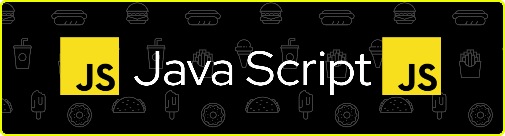

<header> 


<p align="center">

<h6 align="center"> obs: alguns tópicos são clicáveis e mandam direto para a documentação do assunto a que eles se referem. </h6>
</p>

# Breve Resumo de Alguns Conceitos do Java Script

<br>

|                                       Tema                                        |                                               Descrição                                                |                                                                              Exemplos em JavaScript                                                                               |
| :-------------------------------------------------------------------------------: | :----------------------------------------------------------------------------------------------------: | :-------------------------------------------------------------------------------------------------------------------------------------------------------------------------------: |
|                         [**Number**](1_number/number.js)                          |            Tipo de dados para valores numéricos, tanto inteiros quanto de ponto flutuante.             |                                                       `let idade = 25;`<br>`let preco = 19.99;`<br>`let temperatura = -5;`                                                        |
|     [**Operações Aritméticas**](2_operacaoAritimetica\operacaoAritimetica.js)     |                         Operações matemáticas básicas e avançadas com números.                         |                      `let soma = 10 + 5;`<br>`let subtracao = 10 - 5;`<br>`let multiplicacao = 10 * 5;`<br>`let divisao = 10 / 5;`<br>`let resto = 10 % 3;`                       |
|          [**Números Especiais**](3_numerosEspeciais\numerosEspeciais.js)          |              Valores numéricos especiais que representam conceitos matemáticos ou erros.               |                                            `let infinito = Infinity;`<br>`let naoNumero = NaN;`<br>`let infinitoNegativo = -Infinity;`                                            |
|                         [**Strings**](4_string\string.js)                         | Sequência de caracteres usada para representar texto. Delimitadas por aspas simples, duplas ou crases. |                          `let nome = "João"; `<br>` let sobrenome = 'Silva';`<br>`let template = Olá, ${nome}!; `<br>` let frase = "Ele disse: 'Olá!'";`                          |
|          [**Strings Avançados**](5_stringsAvancados\stringsAvancados.js)          |                                     Manipulação avançada de texto.                                     |                                                                       `nome.length`<br>`nome.toUpperCase()`                                                                       |
|                        [**Boolean**](6_boolean\boolean.js)                        |                   Tipo de dados que representa valores lógicos: verdadeiro ou falso.                   |                              `let ativo = true;`<br>`let desligado = false;`<br>`let maior = 10 > 5; // true`<br>`let igual = 10 === "10"; // false`                              |
|                 [**Comparações Booleanas**](6_boolean\index.html)                 |                                  Comparações avançadas com booleanos.                                  |                                                                           `10 === "10"`<br>`10 == "10"`                                                                           |
|            [**Lógica Booleana**](8_logica_booleana\logicaBooleana.js)             |                                             AND, OR e NOT.                                             |                                                                `true && false` `<br>` `true  false` `<br>` `!true`                                                                |
| [**Estruturas de Repetição**](8_estruturas_de_repetição\estruturasDeRepetição.js) |                           Controlam a execução repetida de blocos de código.                           | `for (let i = 0; i < 5; i++) { console.log(i); }`<br>`while (condicao) { /* código */ }`<br>`do { /* código */ } while (condicao);`<br>`for (let item of array) { /* código */ }` |
|    [**Operador Ternário**](9_logicaBooleanaTernario\logicaBooleanaTernario.js)    |                                    Ternário para condições rápidas.                                    |                                                                             `cond ? valor1 : valor2`                                                                              |
|               [**Valores Nulos**](10_valoresNulos\valoresNulos.js)                |                    Representam a ausência intencional de valor ou referência vazia.                    |                                       `let variavelNula = null;`<br>`let variavelIndefinida = undefined;`<br>`let x; // valor é undefined`                                        |
|     [**Conversão Automática**](11_conversaoAutomatica\conversãoAutomatica.js)     |               JavaScript converte automaticamente tipos em operações (coerção de tipos).               |                                `"5" + 1 // "51"`<br>`"5" - 1 // 4`<br>`"5" * "2" // 10`<br>`true + 1 // 2`<br>`false + 1 // 1`<br>`null + 5 // 5`                                 |

<br>

# [**Estruturas de Programação**](12_EstruturasDeProgramacao)

# O que é um [**Programa**](https://www.lenovo.com/br/pt/glossary/program/?orgRef=https%253A%252F%252Fwww.google.com%252F&srsltid=AfmBOorvJZSNoOzhu96MDyhfkGkmtvLOd2YJ5uzvKhvJVeo9Ld6PDVyo) um [**Software**](https://www.lenovo.com/br/pt/glossary/program/?orgRef=https%253A%252F%252Fwww.google.com%252F&srsltid=AfmBOorvJZSNoOzhu96MDyhfkGkmtvLOd2YJ5uzvKhvJVeo9Ld6PDVyo) e um [**Hardware**](https://www.lenovo.com/br/pt/glossary/program/?orgRef=https%253A%252F%252Fwww.google.com%252F&srsltid=AfmBOorvJZSNoOzhu96MDyhfkGkmtvLOd2YJ5uzvKhvJVeo9Ld6PDVyo) ?

- Um programa ou software é um conjunto de instruções, dados e programas que dizem a um dispositivo digital o que fazer para realizar tarefas específicas. Diferente do hardware (a parte física), o software é a parte lógica e intangível, que inclui sistemas operacionais, aplicativos e ferramentas de um computador, celular ou outro dispositivo.

<br>

# Conceitos <br>

- Instruções: São a base do software. Uma sequência de instruções que diz ao computador como realizar uma tarefa é chamada de programa.

- Programa: é um conjunto organizado de instruções que dizem ao computador o que fazer, a fim de obter um resultado específico. Essas instruções são escritas em uma linguagem de programação e formam a base de todo o software que utilizamos.

- Software: refere-se à parte lógica do computador. É o conjunto de instruções, dados e programas que dizem ao hardware o que fazer. O software é intangível; você não pode tocá-lo fisicamente da mesma forma que toca um mouse.

- Hardware: é toda a parte física do computador ou sistema eletrônico. É tudo aquilo que você pode tocar e ver.

<br>

# Exemplos de Programas

## Sistemas Operacionais

- Fazem o computador funcionar (ex: Windows, macOS).

## Aplicativos

- Ferramentas que permitem que o usuário realize tarefas específicas, como:

- Processadores de texto (ex: Microsoft Word).

- Navegadores de internet (ex: Chrome, Firefox).

<br>

# Exemplos de Software

## Sistemas Operacionais

- Windows, macOS, Linux, Android (gerenciam os recursos do hardware).

## Aplicativos/Programas

- Navegadores de internet (Chrome, Firefox), editores de texto (Word, Google Docs), jogos, softwares de edição de imagem.

## [Firmware](https://tecnoblog.net/responde/o-que-e-firmware/):

- Um tipo específico de software de baixo nível que controla dispositivos de hardware básicos (como a BIOS do computador)

<br>

# Exemplos de Hardware <br>

- Unidade Central de Processamento (CPU): O "cérebro" do computador.

- Memória RAM: O local de trabalho temporário do computador.

- Dispositivos de Armazenamento: Disco rígido (HD), SSD, pen drives.

- Periféricos de Entrada: Teclado, mouse, microfone, câmera.

- Periféricos de Saída: Monitor, impressora, alto-falantes.

- Placa-mãe: O circuito principal que conecta todos os componentes.

<br>

# Jogos

- Softwares de edição de fotos e vídeos.

- Ferramentas de IA: Programas de inteligência artificial, como o ChatGPT.

<br>

# Em resumo

- Um programa é um conjunto individual de instruções para uma tarefa.

- Um software é uma coleção de programas e outros dados que trabalham juntos.

- Em termos práticos, "programa" e "software" são frequentemente usados de forma intercambiável para se referir a um aplicativo ou sistema que você usa em um dispositivo.

<br>

# Principais Diferenças de Programa e Software

|      Categoria de Análise      |                                                                                                                   Hardware (Physical Layer)                                                                                                                    |                                            Software (Computer Software)                                            |                                 Programa (Computer Program)                                  |
| :----------------------------: | :------------------------------------------------------------------------------------------------------------------------------------------------------------------------------------------------------------------------------------------------------------: | :----------------------------------------------------------------------------------------------------------------: | :------------------------------------------------------------------------------------------: |
|        Definição Básica        |                                                                                                        Componentes físicos e eletrônicos do computador                                                                                                         |             Um termo guarda-chuva que inclui o programa principal, dados operacionais e documentação.              |                       Componentes físicos e eletrônicos do computador.                       |
|            Natureza            |                                                                                                              Tangível (você pode tocar e sentir).                                                                                                              |                                        Tangível (você pode tocar e sentir).                                        |                          Foco na solução (produto lógico completo).                          |
|              Foco              |                                                                                           Fornecer a capacidade de processamento, armazenamento e interação física.                                                                                            |                        Solução completa, incluindo design, regras de negócio e usabilidade.                        |              Gerenciar a interação entre o usuário e o hardware de forma útil.               |
|          Componentes           |                        Partes físicas do computador, placa-mãe,processador (CPU),memória RAM, dispositivos de armazenamento (HD ou SSD), placa de vídeo (GPU), periféricos de entrada e saída como teclado, mouse, monitor e impressora                        |                        Código, scripts, bibliotecas, manuais e outros artefatos de suporte.                        |                          Principalmente o código-fonte/executável.                           |
|           Uso comum            |                                                         fornecer a base física e tangível que permite o funcionamento de qualquer dispositivo eletrônico, desde um smartphone até um supercomputador.                                                          |                     Termo técnico e jurídico mais formal para se referir ao produto completo.                      | Muitas vezes usado como sinônimo de software no dia a dia, mas tecnicamente mais específico. |
|             Escopo             |                                                           Definição do trabalho necessário para entregar um projeto de hardware, incluindo suas metas, resultados, requisitos, limites e restrições                                                            | Abrange todos os componentes lógicos necessários para uma solução completa (programas, dados, documentação, etc.). |               Restrito ao conjunto de instruções executáveis para uma tarefa.                |
|       Componentes Chave        |                                                                                              Arquivos executáveis como `.exe` , `.bin`, e scripts interpretáveis.                                                                                              |       Executáveis, bibliotecas (DLLs), arquivos de configuração, manuais de usuário, ícones, bases de dados.       |                         Código-fonte e arquivo executável compilado.                         |
|         Ciclo de Vida          |                                             Todas as etapas pelas quais um equipamento passa, desde a sua concepção e aquisição até o descarte, com o objetivo de otimizar seu uso e retorno sobre o investimento                                              |   Abrange todo o ciclo: análise de requisitos, design, codificação (programa), teste, implantação e manutenção.    |                Parte da fase de implementação/codificação do desenvolvimento.                |
| Intenção do Usuário ou Cliente |                       Atingir objetivos de negócio através de recursos tecnológicos confiáveis e adequados, como redução de custos, aumento da produtividade, melhora da experiência do usuário e garantia de segurança e conformidade.                        |  Altamente flexível; pode ser modificado, atualizado e integrado com outros sistemas para formar novas soluções.   |        Menos flexível isoladamente; geralmente projetado para uma função específica.         |
|        Exemplo Prático         |                                                                                                      Um chip de memória RAM ou o processador Intel Core.                                                                                                       |                         O sistema operacional Windows 11 inteiro instalado no computador.                          |                 O código do sistema operacional que gerencia a memória RAM.                  |
|      Perspectiva Jurídica      | A perspectiva jurídica do hardware o considera, primariamente, um bem físico ou material, sujeito às leis de propriedade industrial, como patentes, e ao Código de Defesa do Consumidor. Isso contrasta com o software, que é protegido por direitos autorais. |            Termo padrão em contratos de Licenciamento de Software, propriedade intelectual e patentes.             |            Geralmente não é um termo usado em contratos formais de licenciamento.            |
|          Dependência           |                                                                                                           Requer software e programas para ser útil.                                                                                                           |                          Depende do hardware para rodar e usa programas como seu núcleo.                           |                          Depende do hardware e é parte do software.                          |
|         Modo de Falha          |                                                                                                     Falha física (quebrou, superaqueceu, curto-circuito).                                                                                                      |                                Bug lógico (erro na sequência de instruções, crash).                                |         Problema de design, usabilidade ou licenciamento (não atende ao requisito).          |

<br>

# Principais Diferenças: Hardware × Software × Programa

| Aspecto               | Hardware                                                 | Software                                                                    | Programa                                                   |
| --------------------- | -------------------------------------------------------- | --------------------------------------------------------------------------- | ---------------------------------------------------------- |
| **Definição**         | Componentes físicos e tangíveis do sistema computacional | Conjunto completo de componentes lógicos (programas + dados + documentação) | Conjunto específico de instruções para executar uma tarefa |
| **Natureza**          | Tangível (físico)                                        | Intangível (lógico)                                                         | Intangível (lógico)                                        |
| **Exemplo**           | Processador, memória RAM, SSD                            | Windows 11, Pacote Office                                                   | Algoritmo de ordenação, driver específico                  |
| **Ciclo de Vida**     | Fabricação → Uso → Descarte                              | Análise → Desenvolvimento → Manutenção                                      | Codificação → Compilação → Execução                        |
| **Modo de Falha**     | Danos físicos (quebra, superaquecimento)                 | Bugs lógicos, incompatibilidades                                            | Erros no algoritmo, lógica incorreta                       |
| **Perspectiva Legal** | Bens materiais (patentes)                                | Propriedade intelectual (direitos autorais)                                 | Parte integrante do software                               |

<br>

## Pontos Relevantes

1. **Hierarquia**: Hardware → Programa → Software → Solução
2. **Interdependência**: Software precisa de hardware; programas são partes do software
3. **Escala**: Vários programas compõem um software completo
4. **Contexto**: No dia a dia, "programa" é usado como sinônimo de "software"

## Analogia

Pense em um restaurante:

- **Hardware** = Cozinha, fogão, utensílios
- **Programa** = Receita específica (ex: como fazer molho bechamel)
- **Software** = Restaurante completo (cardápio, receitas, atendimento, ambiente)

<br>

# [Escopo](https://developer.mozilla.org/pt-BR/docs/Glossary/Scope)

- Oque acontece dentro de uma função fica separado do **escopo global**.
- O **escopo global** seria todo o arquivo de Java Script.

```js
let y = 10;
function imprimir() {
  let y = 150;
  console.log(y);
}

imprimir();

console.log(y);
```

- Atualmente com **let e const**, qualquer bloco de código pode separar seu escopo **(um if por exemplo)**.
- Isso é muito bom pois separa os contextos, com **var** isso não acontece.
- Podemos ter escopos diferentes não só como **funções**.

```js
let x = 10;

if (true) {
  let x = 20;
  console.log(x); // escopo if
}

console.log(x); // escopo global
```

# [Escopo Aninhado](https://developer.mozilla.org/pt-BR/docs/Glossary/Scope)

- Por causa da possibilidade de criar um escopo, podemos ter mais níveis de escopo

```js
let y = 5;

const multiplicar = function (n) {
  let y = n * 2;

  console.log(y); // escopo função

  if (y == 10) {
    let y = 55;

    console.log(y); // escopo if dentro da função
  }

  console.log(y);
};

console.log(y);
```

```js
let a = 10;

function multiplicar(x, y) {
  let a = x * y;

  if (a > 10) {
    let a = 0;

    console.log(a);
  }

  console.log(a);
}

console.log(a);
multiplicar(3, 7);
```

# [Arrow Function](https://developer.mozilla.org/pt-BR/docs/Web/JavaScript/Reference/Functions/Arrow_functions)

- Outra forma de escrever funções
- Utilizada em Frameworks Modernos
- Não deve substituir funções por completo

```js
const parOuImpar = (n) => {
  return n % 2;
};

console.log(parOuImpar(3));

let consoleTeste = () => {
  console.log("Olá Mundo!");
};

consoleTeste();

let soma = (a, b) => {
  return a + b;
};

console.log(soma(10, 20));
```

- Se temos um parâmetro só, podemos remover o parentêses do argumento e do return.
- Se a expressão for pequena pode até ser feita em uma linha sem prejudicar a
  leitura do código

```js
const raizQuadrada = (x) => {
  return x * x;
};

const raizQuadrada2 = (n) => n * n;

console.log(raizQuadrada(2));
console.log(raizQuadrada(16));
```

# [Argumentos Opcionais](https://developer.mozilla.org/pt-BR/docs/Web/JavaScript/Reference/Functions/arguments)

- Podemos chamar uma função java script sem o número igual de parâmetros determinados

```js
function nomeComIdade(nome, idade) {
  if (idade === undefined) {
    console.log("Seu nome é" + nome);
  } else {
    console.log("Seu nome é" + nome + " e você tem " + idade + "anos");
  }
}

nomeComIdade("João", 42);
nomeComIdade("João");

function saudacao(nome, idade) {
  if (idade === undefined) {
    console.log("Olá " + nome);
  } else {
    console.log("Olá " + nome + " você tem " + idade + " anos");
  }
}

saudacao("Mateus");

saudacao("Larissa", 90);
```

# Argumentos Com Valor Default

```js
function repetirFrase(frase, n = 2) {
  for (let x = 1; x <= n; x++) {
    console.log(frase + "  " + x);
  }
}

repetirFrase("Testando", 5);
repetirFrase("Duas vezes");

// Outro Exemplo

function potencia(base, expoente = 2) {
  return Math.pow(base, expoente);
}

console.log(potencia(1));
console.log(potencia(2, 4));
console.log(potencia(5));
console.log(potencia(7, 10));
```

# [Closure](https://developer.mozilla.org/pt-BR/docs/Web/JavaScript/Guide/Closures)

- Função que retorna outra função

```js
function armazenarSoma(x) {
  return (y) => x + y;
}

let soma1 = armazenarSoma(3);
console.log(soma1(5)); // 8
let soma2 = armazenarSoma(5);
console.log(soma2(10)); // 15
```

# [Recursion](https://developer.mozilla.org/pt-BR/docs/Glossary/Recursion)

- Uma funcionalidade que permite uma função se chamar novamente
- Pode ser um problema caso ela se chame muitas vezes

```js
function retornarNumeroPar(n) {
  if (n % 2 == 0) {
    console.log("n agora é par: " + n);
  } else {
    console.log(n);
    retornarNumeroPar(n - 1);
  }
}

retornarNumeroPar(225);
```

# Objetos e Arrays

## [Arrays](https://developer.mozilla.org/pt-BR/docs/Web/JavaScript/Reference/Global_Objects/Array)

- Possibilidade de adicionar um conjunto de valores a uma variável
- Sempre escrito entrre colchetes "[ ]" e com valores separados por vírgulas

```js
let numeros = [1, 2, 3, 4, 5];

let informacoes = ["Nome", "Fulano", "Java-Script", true];
```

- Podemos acessar um array pelo seu índice, por exemplo arr[1];
- O primeiro índice de um array sempre é 0.

```js
let array = [1, 2, 3, 4, 6, 99];
let linguagens = ["JAVA", "RUBY"];
let bool = [true, false, 0, 1];

console.log(array[1]);
console.log(linguagens[1]);
console.log(bool[bool.length - 1]); // último termo do array
```

# [Propriedades](https://developer.mozilla.org/pt-BR/docs/Web/JavaScript/Reference/Global_Objects/Array)

- Informações que podem ser verificadas de um valor
- Quase todos os valores JS têm propriedades, menos null e undefined

```js
let array = [1, 2, 3, 4, 6, 99];
let linguagens = ["JAVA", "RUBY"];
let bool = [true, false, 0, 1];

console.log(array.length);
console.log(linguagens["length"]);
console.log(bool[bool.length - 1]); // último termo do array

let nome = "Mateus";

console.log(nome.legth); // Quantidade de Caracteres
```

# [Métodos](https://developer.mozilla.org/pt-BR/docs/Web/JavaScript/Reference/Functions/Method_definitions)

- São propriedades que funcionam como funções
- Strings e Arrays contém métodos

```js
let marca = "nike";

console.log(typeof marca.toUpperCase);
console.log(marca.toUpperCase);
```

- Diferença entre propriedade e método

### Propriedade

- Armazenam dados (características/atributos) de um objeto

### Método

- São funções armazenadas como propriedades, definindo o comportamento (ações) do objeto

```js
// string.propriedade

// string.metodo()
```

# [Objetos](https://developer.mozilla.org/pt-BR/docs/Web/JavaScript/Guide/Working_with_objects)

- Coleção de propriedades

```js
let pessoa = {
  nome: "Matheus",
  profissao: "Programador",
  idade: 28,
};

console.log(pessoa.nome);
console.log(pessoa.idade);
```

## Deletando e criando propriedade

- Podemos adicionar e deletar propriedades ao longo do código

```js
let carro = {
  marca: "Fiat",
  portas: 4,
  eletrico: false,
  motor: 1.0,
};

console.log(carro.portas);

delete carro.portas;

console.log(carro.portas);

carro.tetoSolar = true;

console.log(carro.tetoSolar);
```

## Copiando Objetos

- Podemos copiar todas as propriedades de um objeto para outro

```js
let objetoA = {
      prop1: 'teste',
      prop2: 'testando',
}

let objetoB = {
      prop3 = 'propriedeade',
}
```

## [Mutação, Mutability](https://developer.mozilla.org/pt-BR/docs/Web/API/MutationObserver)

- Um objeto pode herdar todas as características de outro, virando uma referência a ele.

```js
let objetoA = {
  pontos: 10,
};

objetoB = objetoA;

let objetoC = {
  pontos: 10,
};

console.log(objetoA == objetoB); // true
console.log(objetoA == objetoC); // false
```

## [Loops Em Arrays](https://developer.mozilla.org/en-US/docs/Web/JavaScript/Guide/Loops_and_iteration)

- Um técninca muito utilizada na programação
- Como pe uma lista de muitos valores, precisamos ver cada um deles

```js
let numeros = [1, 5, 20, 25, 24];

for (let i = 0; i <= numeros.length; i++) {
  console.log(numeros[i]);
}
```

## [Push & Pop](https://valchan.com.br/pop-push-shift-unshift/)

- Push serve para adicionarmos elementos ao array
- Pop serve para removermos elementos do array

```js
let pessoas = ["Matheus", "João", "Ricardo"];

let pessoaRemovida = pessoas.pop();

console.log(pessoas);

console.log(pessoaRemovida);
```

## [Shift & Unshift](https://valchan.com.br/pop-push-shift-unshift/)

- Remove o primeiro elemento de um array
- Unshift adiciona um ou mais elementos no início de um array

```js
let frutas = ["Maçã", "Melão", "Uva"];

let frutaRemovida = frutas.shift();

console.log(frutas);
console.log(frutRemovida);
```

## [indexOf e lastIndexOf](https://developer.mozilla.org/pt-BR/docs/Web/JavaScript/Reference/Global_Objects/String/lastIndexOf)

- IndexOf: encontra o índice de um determinado elemento;
- lastIndexOf: encontra o último índice de um elemento;

```js
let numeros = [0, 2, 4, 6, 21];

console.log(numeros.indexOf(1));
console.log(numeros.lastIndexOf(1));
```

## [Slice](https://developer.mozilla.org/en-US/docs/Web/JavaScript/Reference/Global_Objects/Array/slice)

- Retorna um array a partir de outro array
- O array retornado é determinado pelos parâmetros que são os índices de início e fim do novo array

```js
let numeros = [0, 2, 4, 6, 21];

console.log(numeros.slice(2, 1));
console.log(numeros.slice(4));
```

## [forEach](https://developer.mozilla.org/en-US/docs/Web/JavaScript/Reference/Global_Objects/Array/forEach)

- Vai iterar cada elemento do array

```js
const numeros = [0, 2, 4, 6, 21];

numeros.forEach((num) => {
  console.log(num);
});
```

## [Includes](https://developer.mozilla.org/pt-BR/docs/Web/JavaScript/Reference/Global_Objects/Array/includes)

- verificar se um array tem determinado elemento

```js
let carros = ["BMW", "FIAT", "AUDI"];

console.log(carros.includes("FIAT"));
```

## [Trim](https://developer.mozilla.org/pt-BR/docs/Web/JavaScript/Reference/Global_Objects/String/trim)

- Remove tudo que não é string

```js
let texto = "      \n teste \n        ";

console.log(texto.trim());
```

## [PadStart](https://developer.mozilla.org/pt-BR/docs/Web/JavaScript/Reference/Global_Objects/String/padStart)

- Inserir caracteres antes da string;

```js
let milAoContrario = "1";

console.log(milAoContrario.padStart());
```

## [Split](https://developer.mozilla.org/pt-BR/docs/Web/JavaScript/Reference/Global_Objects/String/split)

- Divide uma string por um separador, e retorna um array

```js
let frase = "O rato roeu a roupa do rei de Roma";

let palavras = frase.split(" ");

console.log(palavras);
```

## [Join](https://developer.mozilla.org/en-US/docs/Web/JavaScript/Reference/Global_Objects/Array/join)

- Junta elementos em um arrau-y em uma frase, por meio de um separado

```js
let frase = "Testando o metodo join";
let palavras = frase.split(" ");

let novaFrase = palavras.join("@");

console.log(novaFrase);

console.log(palavras.join(" "));
```

## [Repeat](https://developer.mozilla.org/pt-BR/docs/Web/JavaScript/Reference/Global_Objects/String/repeat)

- Repete uma string de acordo com um parâmetro number

```js
console.log("teste".repeat(5));
```

## [Rest Operator](https://developer.mozilla.org/pt-BR/docs/Web/JavaScript/Reference/Functions/rest_parameters)

- Um forma de uma função receber indefinidos parâmetros
- O operador rest vai virar um array
- O parâmetro é definido por: ..."nome" (sem aspas)

```js
function imprimirNumeros(...args) {
  for (let i = 0; i < args.length; i++) {
    console.log(args[i]);
  }
}
```

## [Destructuring](https://developer.mozilla.org/en-US/docs/Web/JavaScript/Reference/Operators/Destructuring)

- Podemos Definir variáveis com propriedades de objeto com uma notação diferente, chamada destructuring;

```js
const person = {
  name: "jhon",
  lastname: "Doe",
};

const { name: fname, lastname: lname } = person;

console.log(fname);
console.log(lname);
```

## [Destructuring Com Array](https://developer.mozilla.org/en-US/docs/Web/JavaScript/Reference/Operators/Destructuring)

- Podemos Definir variáveis com os valores de um array utilizando o destructuring;

```js
let nomes = ["Mateus", "João", "Pedro"];

let [nomeA, nomeB, nomeC] = nomes;

console.log(nomeA);
console.log(nomeB);
console.log(nomeC);
```

# [JSON](https://www.json.org/json-en.html), [JavaScript Object Notation](https://www.json.org/json-en.html)

- Utilizado para comunicação entre serviços como back end <-> front end
- Tipo de dado padronizado que lembra os objetos do java script

### Regras de Ouro para JSON

- Aspas Duplas: Apenas aspas duplas " são válidas para chaves e strings. Aspas simples ' causam erro.
- Vírgulas: Use vírgulas para separar pares chave/valor e elementos de array, mas não coloque vírgula após o último item.
- Estrutura: Objeto começa com { e termina com }, array começa com [ e termina com ].
- Validação: Use ferramentas como [JSONLint](https://developer.mozilla.org/pt-BR/docs/Learn_web_development/Core/Scripting/JSON) ou validadores online para garantir a sintaxe correta.

```json
{
  "name": "Mateus",
  "age": 29,
  "position": "Developer",
  "languages": ["PHP", "JAVA SCRIPT", "PYTHON"]
}
```

- Estrutura rigorosa, com padrão bem fixado
- Apenas aspas duplas
- Não aceita comentários

- Podemos conversert JSON para STRING de forma fácil

```js
const car = {
  brand: "BMW",
  wheels: 4,
  doors: 4,
  type: "SUV",
};

let jsonToString = JSON.stringfy(car);

console.log(jsonToString);

// Resultado =
```

- Ou também uma string para json

```js
let pessoa = {
  name: "Mateus",
  age: 29,
  position: "Developer",
  hobbies: ["Desenvolver", "Estudar", "Correr"],
};

let pessoaToString = JSON.stringify(pessoa);

console.log(pessoaJson);

// converte json para string

let pessoaToJson = JSON.parse(pessoaToString);
console.log(pessoaToJson);
// volta a ser JSON
```

<p align="center">

# [Orientação a Objetos](https://developer.mozilla.org/pt-BR/docs/Learn_web_development/Extensions/Advanced_JavaScript_objects)

- A orientação a objetos é uma forma de programar, que utiliza os objetos como o seu principal principio;
- Além de utilizar conceitos e técnicas que envolvem objetos;
- A maioria dos softwares, na parte de back-end, säo desenvolvidos em cima desse paradigma;
- Grandes frameworks se aproveitam desta técnica: [Laravel](https://laravel.com/), [Django](https://www.djangoproject.com/) e etc.

# [Métodos](https://developer.mozilla.org/pt-BR/docs/Web/JavaScript/Reference/Functions/Method_definitions)

- Propriedades que servem como funções, ou seja as açoes dos objetos,
- invocamos os métodos das mesmas maneiras que as funções
- Separados por vírgula
- Não é necessário usar console.log para chamar métodos;

```js
let cachorro = {
  latir: function () {
    console.log("AUAUAUAUA");
  },
};

cachorro.latir();
```

- Normalmente os métodos interagem com os objetos
- Até mudando os valores das suas propriedades para corresponder a lógica do programa;

```js
let pessoa = {
  nome: "",
  setNome: function (novoNome) {
    this.nome = novoNome;
  },
  getNome: function () {
    return this.nome;
  },
};

pessoa.setNome("Luluzinha");
console.log(pessoa.getNome());
```

- utilizando [getters and setters](https://www.devmedia.com.br/javascript-getters-e-setters/41198)

# [Prototype](https://developer.mozilla.org/en-US/docs/Learn_web_development/Extensions/Advanced_JavaScript_objects/Object_prototypes)

- Um objeto fallback de outro objeto;
- Quando um objeto recebe uma requisiqäo de uma propriedade que näo tem, ela é procura no prototype deste objeto;
- O prototype de um objeto criado do zero é o Object, que tem os métodos nativos da linguagem;

```js
let pessoa = {
  maos: 2,
};
console.log(Object.getPrototypeOf(pessoa));
console.log(Object.getPrototypeOf(pessoa) == Object.prototype);

console.log(pessoa.hasOwnProperty("maos"));
```

- Quando criamos um objeto a partir de um outro, o base será o prototype;
- Ele herdará tanto os métodos e propriedades de Object (o prototype do objeto base);
- Quanto os do objeto base para este novo;

```js
let pessoa = {
  maos: 2,
};

let pessoaNova = Object.create(pessoa);

console.log(Object.getPrototypeOf(pessoa));
console.log(Object.getPrototypeOf(pessoa) == Object.prototype);

console.log(pessoa.hasOwnProperty("maos"));
```

# [Classes](https://developer.mozilla.org/pt-BR/docs/Web/JavaScript/Reference/Classes)

- O prototype do JavaScript pode ser chamado de classe;
- Pois nas outras linguagens uma Class(classe) é um molde de um objeto;
- Ou seja, podemos criar diversos objetos em cima de um prototype;

```js
let cachorro = {
  raca: "Sem raça definida",
};

let pastorAlemao = object.create(cachorro);

pastorAlemao.raca = "Pastor Alemão";

console.log(pastorAlemao.raca);
```

- Não podemos adicionar propriedades na classe, somente via PROTOTYPE
- Classes só aceitam métodos

```js
class Cachorro {
  constructor(raca, cor) {
    this.raca;
    this.cor;
  }

  latir() {
    console.log("Au Au");
  }
}

Cachorro.prototype.patas = 4;
```

# [Construtor por função](https://developer.mozilla.org/pt-BR/docs/Web/JavaScript/Reference/Classes/constructor)

- Construtores são formas de instanciar uma classe em uma linguagem de programação;
- Instanciar = criar um objeto novo;
- No construtor já podemos definir propriedades;

```js
function criarCachorro(raca) {
  let cachorro = Object.create({});
  cachorro.raca = raca;
  return cachorro;
}

let doberman = criarCachorro("Doberman");

console.log(doberman.raca);
```

# [Construtor por new](https://developer.mozilla.org/pt-BR/docs/Web/JavaScript/Reference/Classes/constructor)

- Em muitas linguagens temos a opção de instanciar um objeto com new, também no javascript.
- Usamos a 1ª letra maiúscula pois é uma convenção.

```js
function Cachorro(raca) {
  this.raca = raca;
}

let husky = new Cachorro("Husky");

console.log(husky.raca);
```

# [Construtor com método](https://developer.mozilla.org/pt-BR/docs/Web/JavaScript/Reference/Classes/constructor)

- Além de propriedades, podemos criar a classe base já com métodos;
- Basta definir ao prototype o método desejado;

```js
function Cachorro(raca) {
  this.raca = raca;
}

Cachorro.prototype.uivar = function () {
  console.log("Auuuuuuuuuuuuu");
};

let pug = new Cachorro("Pug");

console.log(pug.raca);
pug.uivar();
```

# Construtor com [ES6](https://www.w3schools.com/js/js_es6.asp)

- O ES6 (ou ECMAScript 2015) foi o divisor de águas para o JavaScript moderno. Ele trouxe recursos que tornaram o código muito mais legível, elegante e "com cara" de linguagem de programação robusta.

```js
class Cachorro {
  constructor(raca, patas, cor) {
    this.raca;
    this.patas;
    this.cor;
  }
}

let labrador = new Cachorro("Labrador", 4, "Amarelo");

console.log(labrador);
```

# [Override nas Propriedades do Prototype](https://stackoverflow.com/questions/22060748/overriding-prototype-property-or-function)

- Sempre que adicionamos uma propriedade a um objeto, é criada
  uma idêntica no Prototype;
- Podemos substituir a do prototype;

```js
class Cachorro {
  constructor(raca) {
    this.raca;
  }
}

let poodle = new Cachorro("Poodle");

Cachorro.prototype.raca = "Sem raça definida";

console.log(poodle.raca);
console.log(Cachorro.prototype.raca);
```

# [Symbols](https://developer.mozilla.org/en-US/docs/Web/JavaScript/Reference/Global_Objects/Symbol)

- Propriedades ünicas, que näo podem ser alteradas e nem criadas duas vezes;
- Podemos utilizar como uma constante, Sö que para propriedade de objeto;

```js
class Cachorro {
  constructor(raca) {
    this.raca;
  }
}

let patas = Symbol();

Cachorro.prototype[patas] = 4;

let golden = new Cachorro("Golden Retriever");
```

# [Getters](https://developer.mozilla.org/pt-BR/docs/Web/JavaScript/Reference/Functions/get) e [Setters](https://developer.mozilla.org/pt-BR/docs/Web/JavaScript/Reference/Functions/set)

- Método Get e Set
- Get: serve para resgatar o valor de uma propriedade;
- Set: serve para alterar o valor de uma propriedade;

```js
class Cachorro {
  constructor(raca) {
    this.raca = raca;
  }

  get verRaca() {
    return "A raça é " + this.raca;
  }
  set novaRaca(value) {
    this.raca = value;
  }
}

let golden = new Cachorro("Pastor Alemão");
console.log(golden.verRaca);
golden.novaRaca = "Golden";

golden.setCor = "Marrom";

console.log(golden.getCor);
```

# [Herança](https://developer.mozilla.org/pt-BR/docs/Learn_web_development/Extensions/Advanced_JavaScript_objects/Classes_in_JavaScript)

- Uma classe pode herdar propriedades de outra classe por heranqa;
  Para isso utilizamos extends;

```js
class Mamifero {
  constructor(patas) {
    this.patas = patas;
  }
}

class Cachorro extends Mamifero {
  constructor(patas, raca) {
    super(patas, patas);
    this.raca = raca;
  }
}

let pug = new Cachorro(4, "Pug");
console.log(pug);
```

## [InstanceOf operator](https://developer.mozilla.org/pt-BR/docs/Web/JavaScript/Reference/Operators/instanceof)

- Podemos verificar quem é o pai do objeto utilizando o instanceOf
- Usado para um controle melhor do código

```js
class Mamifero {
  constructor(patas) {
    this.patas = patas;
  }
}

class Camelo {
  constructor(patas) {
    this.patas = patas;
  }
}

let coiote = new Mamifero(4);
console.log(coiote.patas);

class Cachorro extends Mamifero {
  constructor(patas, raca) {
    super(patas, patas);
    this.raca = raca;
  }
  latir() {
    console.log("Au Au");
  }
}

let pug = new Cachorro(4, "Pug");
console.log(pug.patas);
pug.latir();

console.log(new Cachorro() instanceof Mamifero); // True
console.log(new Cachorro() instanceof Camelo); // false
```

# [Debugs e Tratamento de Erros, ou Depuração](https://www.ibm.com/br-pt/think/topics/debugging)

- Os [bugs](https://en.wikipedia.org/wiki/Software_bug) são problemas ou erros no código, pode ser causado pelo programador ou não e impede que o código seja executado da forma correta
- Os [debugs](https://www.hostgator.com.br/blog/debug-desenvolvimento-web/?gad_source=1&gad_campaignid=22134387764&gbraid=0AAAAAD5rgDa1WUh5CaUy54sZK0IJ0wQt9&gclid=Cj0KCQjwgr_NBhDFARIsAHiUWr5eHxK90dk4pDAmJN6zE-P7AVMvAnP0dJOqKxkWUXOKDGeZlddEJUAaApBNEALw_wcB) são o ato de resolver os bugs no código, debugar seria a forma de resolver os problemas que achamos no código.

# [Strict Mode](https://developer.mozilla.org/pt-BR/docs/Web/JavaScript/Reference/Strict_mode)

- Aumenta a rigorosidade do Java Script tolerando menos erros.
- Devemos declarar acima das funções.
- Não impede e nem limita nada no software e ajuda a codar da forma correta.

```js
"use strict";

opa = "teste";
```

- vai retornar "Uncaught ReferenceError: opa is not definet at window.onload".

```
"use strict"

let opa = 'teste';

delete Object.prototype;
```

- vai retornar "Uncaught TypeError: Cannot delete property 'prototype' of function Object() { [native code] }".

# [Console.Log]()

- Serve Basicamente para mostrar valores no console, para visualização = debugar código

```js
let a = 1;
let b = 2;
let c = 3;

if (c > a) {
  a = b;
  console.log(a); // 2
}

for (let i = 5; i > 0; i--) {
  b++;
  a = a + c + 1;
  c += 2;
  console.log(a);
  /*
  6
  12
  20
  30
  42
  */
}

if (b == a) {
  a++;
} else {
  a = a + b + c;
}

console.log(a); // 62

a = a * b;

console.log(a); // 434
```

# [Debbugger](https://developer.mozilla.org/en-US/docs/Web/JavaScript/Reference/Statements/debugger)

- Vai fazer com que o código não ultrapasse nenhum erro ao encontrá-lo

```js
let a = 1; // a = 8
let b = 2; // b = 2

if (a == 1) {
  // a = 8
  a = b + 2; // b = 2
}

for (i = 0; i < b; i++) {
  // b = 2
  a = a + 2; // a = 8
}

debugger;

if (a > 10) {
  a == 25;
}
```

- O debugger é um breakpoint no código, que o faz parar para debugar e nos informar se está tudo dando certo.

# Tratamento de [Input](https://developer.mozilla.org/en-US/docs/Web/HTML/Reference/Elements/input) por função

- Maneira que utilizamos para tratar os dados que recebemos dos usuários, uma vez que não podemos controlar oque o usuário vai nos enviar.

```js
function checarNumero(valor) {
  let resultado = Number(valor);
  if (Number.isNaN(resultado)) {
    return null;
  } else {
    return resultado;
  }
}

console.log(checarNumero(5));
console.log(checarNumero("teste"));
```

# [Exceptions](https://developer.mozilla.org/en-US/docs/Web/JavaScript/Reference/Global_Objects/Error)

- Criamos erros para abortar o programa ou gerar algum erro.
- Gera dicas e mensagens sobre o erro criado.

```js
let a = 1;

if (a != 2) {
  throw new Error(`O valor de ${a} não pode ser 1`);
}
```

# [Try And Catch](https://developer.mozilla.org/pt-BR/docs/Web/JavaScript/Reference/Statements/try...catch)

- Serve para retornar erros no código e geralmente é usado em blocos, e sempre nos mostra com clareza os erros do nosso código e também da linguagem que estamos usando.
- Muito utilizado em debug

```js
try {
  let c = a + b;
} catch (error) {
  console.log("Algo Deu Errado: " + error);
}
```

# [Finally](https://developer.mozilla.org/en-US/docs/Web/JavaScript/Reference/Global_Objects/Promise/finally)

- Usado para executar algo independente do resultado no TryCatch
- O finally é usado exclusivamente no Try Catch.

```js
try {
  let c = a + b;
} catch (error) {
  console.log("Algo Deu Errado: " + error);
} finally {
  console.log("Executado");
}
```

# [Assertions](https://developer.mozilla.org/en-US/docs/Web/JavaScript/Guide/Regular_expressions/Assertions)

- Asseguram que tudo ocorre da forma que esperamos.

```js
function iterarArray(arr) {
  if (arr.length == 0) {
    throw new Error("O array precisa ter elementos");
  } else {
    for (let i = 0; i < arr.length; i++) {
      console.log(arr[i]);
    }
  }
}
```

# [Expressões Regulares](https://developer.mozilla.org/pt-BR/docs/Web/JavaScript/Guide/Regular_expressions)

- Também chamadas de Regex (Regular Expression)
- Usamos para encontrar padrões em strings
- Alternativa usada para ao invés de criar funções complexas utilizarmos as Expressões Regulares em uma só linha.

## Como criar uma expressão regular:

- Sempre são um tipo de objeto e podem ser instanciadas das seguintes formas:
- "New RegExp"
- "/.../"
- E verificar direto na sentença

```js
let reg1 = new RegExp("Teste");

let reg = /teste/;

console.log(/quadrado/.test("3343Quadrado42242"));
// Reg exp      // Oque buscamos
```

- Sentenças Regulares sempe são [Case Sensitive](https://pt.wikipedia.org/wiki/Case-sensitive)

## Verificar Caracteres usando uma expressão regular:

- Só precisamos colocar entre "[ ]"
- Se usarmos "-" estamos escolhendo um intervalo.

```js
console.log(/[123]/.test("123 por aqui")); //true
console.log(/[1-3]/.test("123 por aqui")); //true
console.log(/[99]/.test("99 noites")); //true
console.log(/[99]/.test("1001 noites")); // false
```

- Usar o método "[ ]", não é muito indicado pois buga faclmente, prefira utilizar o método por intervalo "-".

```js
const reg1 = /[12345]/;

console.log(reg1.test("Número 6"));
console.log(reg1.test("Número 25")); // Retorna true mesmo não sendo.
```

## Verificar [Caracteres Especiais](https://www.rocketseat.com.br/blog/artigos/post/javascript-expressoes-regulares) usando uma expressão regular:

- \d - Qualquer digito de caractere
- \w - Um caractere alfanumérico ("teste")
- \s - Qualquer caractere de espaço em branco
- \D - Caracteres que não são digitos
- \W - Caractere não-alfanumérico
- \S - Caractere que não seja espaço em branco
- "." Qualquer caractere, menos nova linha

```js
const Regexd = /\d/;

console.log(Regexd.test("abcd")); // false
console.log(Regexd.test("1234")); // true
console.log(Regexd.test(" ")); // false
console.log(Regexd.test("*/+-=%")); // false

const Regexw = /\w/;

console.log(Regexw.test("abcd")); // true
console.log(Regexw.test("1234")); // true
console.log(Regexw.test(" ")); // false
console.log(Regexw.test("*/+-=%")); // false

const Regexs = /\s/;

console.log(Regexs.test("abcd")); // false
console.log(Regexs.test("1234")); // false
console.log(Regexs.test(" ")); // true
console.log(Regexs.test("*/+-=%")); // false

const RegexD = /\D/;

console.log(RegexD.test("abcd")); // true
console.log(RegexD.test("1234")); // false
console.log(RegexD.test(" ")); // true
console.log(RegexD.test("*/+-=%")); // true

const RegexW = /\W/;

console.log(RegexW.test("abcd")); // false
console.log(RegexW.test("1234")); // false
console.log(RegexW.test(" ")); // true
console.log(RegexW.test("*/+-=%")); // true

const RegexS = /\S/;

console.log(RegexS.test("abcd")); // true
console.log(RegexS.test("1234")); // true
console.log(RegexS.test(" ")); // false
console.log(RegexS.test("*/+-=%")); // true

const RegexPonto = /\./;

console.log(RegexPonto.test("abcd")); // false
console.log(RegexPonto.test("1234")); // false
console.log(RegexPonto.test(" ")); // false
console.log(RegexPonto.test("*/+-=%")); // false
```

- Formas comuns de uso do Regex Com Caracteres Especiais

```js
let ano = /\d\d\d\d/;
console.log(ano.test("05")); // false
console.log(ano.test("2020")); // true
console.log(ano.test("opa")); // false

let palavraQuatroLetras = /\w\w\w\w/;
console.log(palavraQuatroLetras.test("Davi")); // true
console.log(palavraQuatroLetras.test("Chocolate")); // true
console.log(palavraQuatroLetras.test("Pastel")); // true
console.log(palavraQuatroLetras.test("1234")); // true
```

- Perceba que ao definir que queremos 4 dígitos e temos uma palavra com mais de 4 dígitos, o console mostra "true" pois realmente existem 4 dígitos numa string com mais de 4 dígitos. Uma vez que a pesquisa não se preocupa caso haja mais de 4 dígitos.

- Veja como limitar a pesquisa a somente 4 dígitos.

```js
let palavraQuatroLetras = /\w\w\w\w/;
console.log(palavraQuatroLetras.test("Davi") && "Davi".length == 4); // true
console.log(palavraQuatroLetras.test("Chocolate") && "Chocolate".length == 4); // false
console.log(palavraQuatroLetras.test("Pastel") && "Pastel".length == 4); // false
console.log(palavraQuatroLetras.test("1234") && "1234".length == 4); // true
```

- Dessa forma limitamos o tamanho (length) para 4;

## [Operador Plus +](https://developer.mozilla.org/pt-BR/docs/Web/JavaScript/Reference/Operators)

- Serve para mostrar que um elemento pode se repetir quantas vezes ele quiser.

```js
let palavraQuatroLetras = /\w+/;
console.log(palavraQuatroLetras.test("Davi"));
console.log(palavraQuatroLetras.test("Davi"));
```

## [Operador Question ?](https://developer.mozilla.org/pt-BR/docs/Web/JavaScript/Reference/Operators)

- Serve para mostrar que um elemento é opcional.

```js
let opcional = /Prova\s\d?/;
console.log(palavraQuatroLetras.test("Prova"));
console.log(palavraQuatroLetras.test("Teste"));

const padrao = /Abacax?i/;

console.log("Abacaxi"); // true
console.log("Abacai"); // true

const padrao2 = /\d+\w?/;

console.log(padrao2.test("123")); // true
console.log(padrao2.test("123abc")); // true
```

## [Ocorrências Precisas](https://developer.mozilla.org/pt-BR/docs/Web/JavaScript/Reference/Operators)

- Conhecido como [máscara de entrada](https://dev.to/laurolyra/adicionando-mascaras-nos-inputs-html-js-vanilla-5f1l)
- Podemos definir onde queremos determinado número ou determinado caractere.
- Como em um campo que necessita de um cep podemos definir as suas particularidades.

```js
const cep = /\d{5}-\d{3}/;

console.log(cep.test("12345-531")); // true
console.log(cep.test("1234214")); // false
console.log(cep.test("55555555-555")); // true
console.log(cep.test("Llalala")); // false
```

## Método Exec

- Retorna o Objeto com as Informações sobre o Regex e retorna null caso não encontre nada

```js
let teste = /\d+/.exec("O número 10");

console.log(teste);
console.log(teste.index);
```

## Método Match

- Semelhante ao exec, usamos para mostrar mais informações

```js
let teste = /\d+/.match("O número 10");

console.log(teste);
console.log(teste.index);
```

## Choice Patterns

- É uma instrução semelhante ao OR (||)

```js
let frutas = /\d+ (bananas|maças|laranjas)/;

console.log(frutas.test("10 bananas"));
console.log(frutas.test("2444 maças"));
console.log(frutas.test("75474 laranjas"));
```

# Validando um Domínio na Prática

```js
let validarDominio = /www.\w+\.com|com.br/;

console.log(validarDominio.test("www.google.com"));
console.log(validarDominio.test("www.teste"));
console.log(validarDominio.test("teste.com"));
console.log(validarDominio.test("www.lalalalala.com"));
console.log(validarDominio.test("banana"));
console.log(validarDominio.test("java"));
console.log(validarDominio.test("www.lojalojaloja.com"));
```

# Validando um Email na Prática

```js
let validarEmail = /\w+@\w+\.\w+/;

console.log(validarEmail.test("teste@email.com"));
console.log(validarEmail.test(""));
console.log(validarEmail.test("aaaaaa"));
console.log(validarEmail.test("lalalalalalala"));
console.log(validarEmail.test("q12133@gmail.com"));
```

# Validando Datas

```js
let validarDatas = /^[0-9]{2}[/][0-9]{2}[/][0-9]{4}/;

console.log(validarDatas.test("01/02/2025"));
console.log(validarDatas.test("1/2/25"));
console.log(validarDatas.test("ab/cd/efgh"));
console.log(validarDatas.test("01/02/2025"));
console.log(validarDatas.test("01/02/2025"));
```

# [Programação Assíncrona ](https://developer.mozilla.org/pt-BR/docs/Learn_web_development/Extensions/Async_JS/Introducing)

- A programação assíncrona é uma técnica que permite que seu programa inicie uma tarefa potencialmente de longa duração e ainda seja capaz de responder a outros eventos enquanto essa tarefa é executada, em vez de ter que esperar até que essa tarefa seja concluída. Uma vez que essa tarefa tenha terminado, seu programa é apresentado com o resultado.

```js
const name = "Miriam";
const greeting = `Hello, my name is ${name}!`;
console.log(greeting);
// "Hello, my name is Miriam!"
```

# [Callbacks ](https://developer.mozilla.org/pt-BR/docs/Glossary/Callback_function)

- Uma função callback é uma função passada a outra função como argumento, que é então invocado dentro da função externa para completar algum tipo de rotina ou ação.

- Aqui está um pequeno exemplo:

```js
function greeting(name) {
  alert("Olá " + name);
}

function processUserInput(callback) {
  var name = prompt("Por favor insira seu nome.");
  callback(name);
}

processUserInput(greeting);
```

- O exemplo acima é de uma synchronous callback, uma vez que é executada imediatamente.
- Note, no entanto, que callbacks são normalmente utilizados para continuar a execução do código após uma operação asynchronous ser terminada — essas são chamadas asynchronous callbacks. Um bom exemplo são as funções callback executadas dentro de um bloco .then() encadeado ao final de uma promessa após essa promessa ser cumprida ou rejeitada. Essa estrutura é usada em muitas APIs da web modernas, como a fetch().

# [Promises ](https://developer.mozilla.org/pt-BR/docs/Learn_web_development/Extensions/Async_JS/Promises)

- Promises são a base da programação assíncrona moderna em JavaScript. Uma promise é um objeto retornado por uma função assíncrona, que representa o estado atual da operação. No momento em que a promise é retornada para quem à chamou, a operação muitas vezes ainda não foi finalizada, mas o objeto da promise oferece métodos para tratar o possível sucesso ou falha da operação.
- Com esse design, você chama a função assíncrona, passando sua função de callback como parâmetro. A função executa imediatamente e chama seu callback quando a operação é finalizada.

# Falhas nas Promises

- Resolvemos chamando o catch

```js
let promiseError = Promise.resolve(new Error("Algo Deu Errado"));

promiseError
  .then((value)  => console.log(value))
  .catch(reason => console.log("Erro:" + reason));
```
